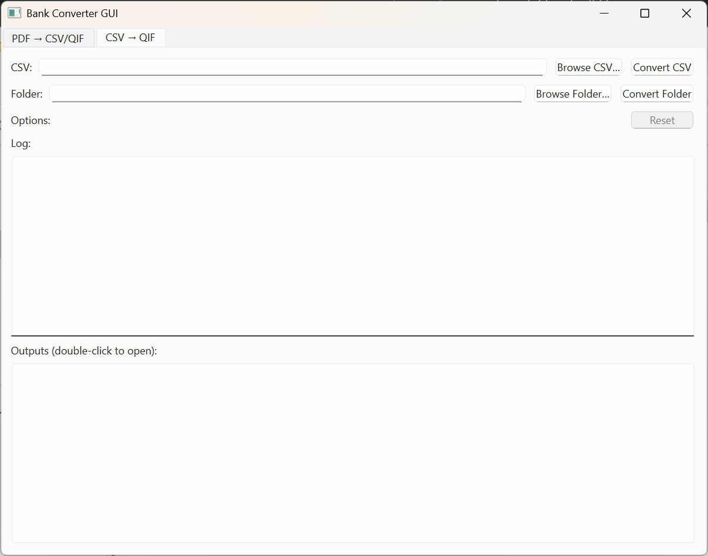

# Australian Bank Statement Converter (bstc)

A tool for converting Australian PDF bank statements to CSV or QIF format. Supports both a command-line interface (CLI) and a graphical interface (GUI).

---

## Table of Contents

- [Overview](#overview)  
- [Features](#features) 
- [Supported Bank Statements](#supported-bank-statements)  
- [Output Format](#output-format)   
- [Installation](#installation)  
- [Usage](#usage)  
  - [CLI Usage](#cli-usage)  
  - [GUI Usage](#gui-usage)  
- [Building a Standalone Executable](#building-a-standalone-executable)  
- [Notes](#notes)  
- [To Do](#to-do)  

---

## Overview

If you only have PDF statements available from one of the major Australian bank, this tool may be able to help you parse these PDF statements and convert them to CSV and/or QIF formats. These converted files are saved in the same folder as the source PDF.

---

## Features

- PDF → CSV conversion  
- CSV → QIF conversion (standalone or chained after PDF → CSV)  
- CLI and GUI modes  
- Can be built as an executable
- Balance-integrity checks (where statements provide running balances and/or opening/closing balances)  

---

## Supported Bank Statements

| Bank              | Statement Type                                                                 | Checks                                                                                     |
| ----------------- | ------------------------------------------------------------------------------ | ----------------------------------------------------------------------------------------- |
| **CBA**           | Business Transaction Account                                                   | Running balance check on every transaction and final closing balance verification        |
| **ANZ**           | Business Advantage / Online Saver / Business Extra                             | Running balance check on every transaction and final closing balance verification        |
| **NAB**           | Transaction Account                                                            | Final check: sum of all transactions vs. (closing balance − opening balance)             |
| **NAB**           | Everyday Business Account                                                            | Final check: sum of all transactions vs. (closing balance − opening balance)             |
| **Westpac (WBC)** | Business One Plus                                                              | Parsing may be potentially be imperfect—`get_transactions` needs refinement. No running-balance checks.  |
| **Bendigo (BEN)** | Business Basic                                                                 | Running balance check on every transaction and final difference between opening & closing balance/total credit/total debit/closing balance verification        |

---

## Output Format

The CSV output includes, for each transaction:

- **Date** - in the format *%d/%m/%Y* (e.g. 01/12/2025) 
- **Transaction Details** - details same as the bank statement 
- **Amount** - in credits (e.g. 50.50) or debits in negative (e.g. -100.25)

The QIF output reuses the same fields in Quicken’s [QIF](https://en.wikipedia.org/wiki/Quicken_Interchange_Format#Data_format)  format.

---

## Installation

1. **Clone the repository**  
   ```bash
   git clone https://github.com/your-username/bstc.git
   cd bstc
   ```

2. **Create and activate a virtual envionment**  
Make sure you're at the root of the package
   ```bash
   python -m venv .venv
   ```
   - On Windows: 
   ```bash
   .venv\Scripts\activate
   ```
   - On macOS/Linux:
   ```bash
   source .venv/bin/activate
   ```

3. **Install dependencies**  

   ```bash
   pip install -r requirements.txt
   pip install -e .
   ```
   - If you want to build a PyInstaller launcher:
   ```bash
   pip install -r requirements-build.txt
   pip install -e .[build]
   ```

---

## **Usage**

## CLI Usage

For a single file:

   ```bash
   bstc file "/path/to/statement.pdf"
   ```

For a folder of pdf files:

   ```bash
   bstc folder "/path/to/folder" --qif --rm_csv
   ```

Common options:
- `-q` or `--qif` : After PDF → CSV conversion does CSV → QIF conversion
- `-r` or `--rm_csv` : After PDF → CSV → QIF conversion, removes intermediary CSV (only works when `-q` is also flagged)


For converting only a single csv file:

   ```bash
   bstc csv2qif "/path/to/file.csv"
   ```

Run `bstc --help` for a full list of commands and options.

## GUI Usage

   ```bash
   bstc-gui
   ```

This opens the a simple GUI window with two tabs.

- Tab for conversion of PDF


- Tab for converison of CSV



Steps:
1. Enter path into file or folder, or select using 'Browse'
2. For PDF conversion, select whether you would also like to further convert to QIF, and whether to remove the intermediary CSV after this conversion (NOTE: these are on by default)
3. Press convert file or folder
4. After conversion the logs will show whether conversion was successful; if so, the outputs can be opened at the bottom by double-clicking
5. If you would like to convert more files, press the 'Reset' button

Converted files will appear in the same directory as the source PDF.

---

## **Building a Standalone Executable**

To package the GUI as a Windows `.exe` using PyInstaller:

   ```bash
   pyinstaller \
      --onefile \ # Optional
      --windowed \
      --name bstc-gui \
      --paths src \
      src/launcher_gui.py
   ```

The generated executable will be in `dist/bstc-gui.exe`.

---

## **Notes**

- Westpac Business One Plus statements don't include opening/closing balances so there are no balance checks. You may need to visually compare the PDF and outputs to verify all transactions are correct.

- CBA converter gets all the transactions as text and runs through it line by line, while all other converters make a grid of coordinates that correspond to a given transaction (depending on whether transactions alternate by fill colour or are separated by a line) and its columns (manually given), and then iterates over them to get the text. This makes the CBA converter much faster (O(n) vs. O(n*m), where n is the number of transactions and m is the number of columns), but may be more prone to errors if the pattern of how the lines are read is different.

---

### **To Do**

- ~~NAB Business Everyday Account; use string of dots as separator of transactions; if dates cell is empty use previous stored date.~~
- Maybe update some of the converters to save the same number of checks as the Bendigo bank converter. 
- ~~Add csv intermediary removal to cli.py.~~
- Maybe add option to specify output path.
- Maybe refactor cli code; add more comments to code.
- ~~Update incorrect number of transactions for converters; also add skip for empty pages just incase~~
- Maybe add undo button for GUI; add drag and drop for file and folders